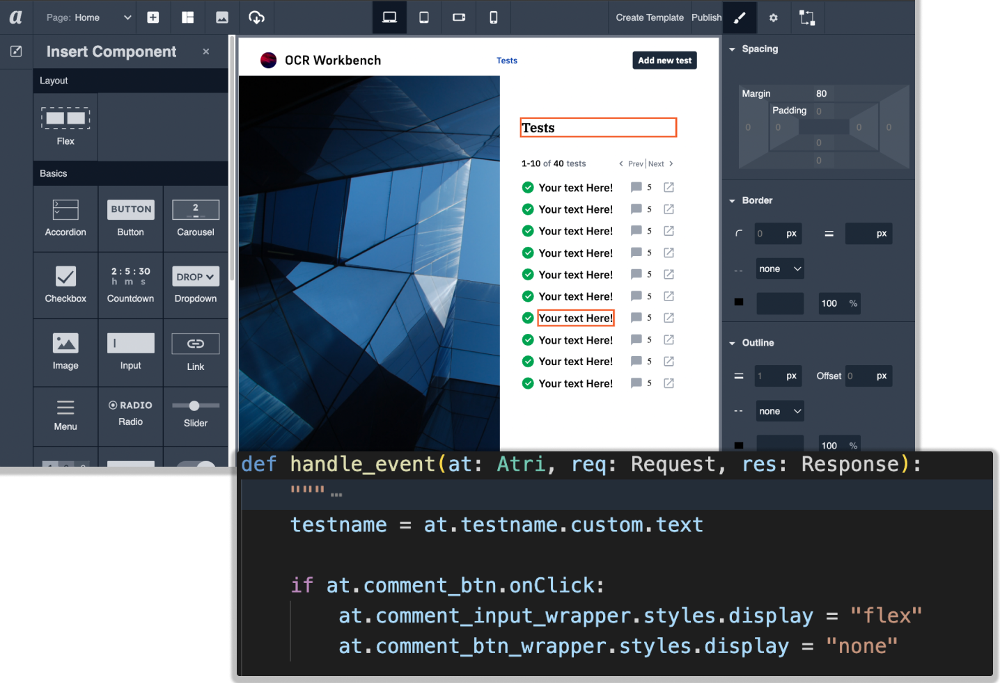

<div align="center">

  <a href="https://github.com/Atri-Labs/atrilabs-engine/issues?q=is%3Aopen+is%3Aissue+label%3Ahacktoberfest" target="_blank"></a>
  </br>
  <a href="https://github.com/Atri-Labs/atrilabs-engine/issues" target="_blank"></a>
  <a href="https://github.com/Atri-Labs/atrilabs-engine/issues?q=is%3Aissue+is%3Aopen+label%3A%22good+first+issue%22" target="_blank"></a>
  <a href="https://github.com/Atri-Labs/atrilabs-engine/issues?q=is%3Aopen+is%3Aissue+label%3Aatri-app" target="_blank"></a>
  <a href="https://github.com/Atri-Labs/atrilabs-engine/issues?q=is%3Aissue+is%3Aopen+label%3Acreate-component" target="_blank"></a>
  </br>
  <a href="https://github.com/Atri-Labs/atrilabs-engine/discussions" target="_blank"></a>
  <a href="https://pepy.tech/badge/atri" target="_blank"></a>
  <a href="https://pepy.tech/badge/atri/month" target="_blank"></a>
  </br>
  
  <h3 align="center">
    <a href="https://docs.atrilabs.com/">Docs</a>
    <span> | </span>
    <a href="https://join.slack.com/t/atricommunity/shared_invite/zt-1e756m1at-bZBxngvw7KWWO0riI4pc0w">Community Slack</a>
    <span> | </span>
    <a href="https://www.youtube.com/channel/UC1uR2Q5x_8olWS_Y4PdK1Bw">YouTube</a>
    <span> | </span>
    <a href="https://www.linkedin.com/company/atri-labs">LinkedIn</a>
    <span> | </span>
    <a href="https://github.com/Atri-Labs/atrilabs-engine/discussions">Discussions</a>
    <span> | </span>
    <a href="https://github.com/mindsdb/mindsdb/projects">Contribute</a>
  </h3>
  
</div>

----------------------------------------

Atri framework is a full-stack web development framework to build Progressive Web Apps. [](https://twitter.com/intent/tweet?text=Check%20out%20this%20new%20full-stack%20web%20development%20framework:%20&url=https://github.com/Atri-Labs/atrilabs-engine&hashtags=webframework,fullstack,react,python)

- Frontend development: Use our visual editor to increase your productivity. You can also add your custom React code
- Backend development: Currently, we support Python for backend development. We are planning to add support for NodeJS soon. 
- Deployment support: Our CLI provides rich support for easy deployment at your platform of choice such as GitHub Pages, AWS, etc. 

If you like our project, please support us by giving us **a star ⭐!**

## What can I build using this framework?

Atri is a general purpose framework that can be used to build everything from e-commerce websites to internal apps. 





### Websites built using Atri framework

- [Personal blog](https://atri-apps.github.io/personal_blog/)
- [Data app](https://atri-apps.github.io/review_tabular_data/)

Find more example websites and apps at [Atri-Apps](https://github.com/orgs/Atri-Apps/repositories). 

## Getting Started

```shell
pipenv install atri
pipenv shell
atri start
```

- The visual editor is available at http://localhost:4002. 
- Once you click `Build and Run` in your visual editor, your website will start running at http://localhost:4005/. 
- All the files for your website are being auto-generated in your local directory.
- You can write the backend of your website at `controllers/routes/<page_name>/main.py`.

You can follow our [video tutorial 👇](https://www.youtube.com/watch?v=cNCUVF9o8oY) or our [written guide](https://docs.atrilabs.com/getting-started/create-app) to create your first Atri app. 

<div align="center">

  [](https://youtu.be/cNCUVF9o8oY)

</div>

## How to contribute?

Thanks for your interest in contributing to the Atri framework. 💖

You can contribute in any or all of the following ways: 

- submit a [bug report](https://github.com/Atri-Labs/atrilabs-engine/issues/new/choose) 
- propose an [Atri app](https://github.com/Atri-Labs/atrilabs-engine/issues/new/choose)
- submit a [documentation report](https://github.com/Atri-Labs/atrilabs-engine/issues/new/choose)
- request a [new feature](https://github.com/Atri-Labs/atrilabs-engine/issues/new/choose)
- suggest ways to [improve DX of an exisiting feature](https://github.com/Atri-Labs/atrilabs-engine/issues/new/choose)
- ask a question in [Discussions](https://github.com/Atri-Labs/atrilabs-engine/discussions)
- create an [Atri App](https://github.com/orgs/Atri-Apps/repositories) and share it with the [community](https://github.com/Atri-Labs/atrilabs-engine/discussions/categories/show-and-tell)
- contribute to the code base: You can get started with ["good first issues"](https://github.com/Atri-Labs/atrilabs-engine/issues?q=is%3Aissue+is%3Aopen+label%3A%22good+first+issue%22) which are suitable for newcomers. 

Please refer to our [contributing guidelines](CONTRIBUTING.md) for details. 

Besides, please make sure you adhere to the [code of conduct](CODE_OF_CONDUCT.md). 

If you make any contribution to our project (code or no-code; check the [vast list of contribution types](https://allcontributors.org/docs/en/emoji-key)), you will be featured in the table below 👇

## Contributors 🎉

<!-- ALL-CONTRIBUTORS-BADGE:START - Do not remove or modify this section -->
[](#contributors-)
<!-- ALL-CONTRIBUTORS-BADGE:END -->

We are grateful to these wonderful people who contributed to Atri framework. 🙏 ([emoji key](https://allcontributors.org/docs/en/emoji-key)):

<!-- ALL-CONTRIBUTORS-LIST:START - Do not remove or modify this section -->
<!-- prettier-ignore-start -->
<!-- markdownlint-disable -->
<table>
  <tbody>
    <tr>
      <td align="center"><a href="https://github.com/cruxcode"><br /><sub><b>Shyam Swaroop</b></sub></a><br /><a href="https://github.com/Atri-Labs/atrilabs-engine/commits?author=cruxcode" title="Code">💻</a> <a href="#infra-cruxcode" title="Infrastructure (Hosting, Build-Tools, etc)">🚇</a> <a href="#projectManagement-cruxcode" title="Project Management">📆</a> <a href="#maintenance-cruxcode" title="Maintenance">🚧</a> <a href="#mentoring-cruxcode" title="Mentoring">🧑‍🏫</a> <a href="https://github.com/Atri-Labs/atrilabs-engine/pulls?q=is%3Apr+reviewed-by%3Acruxcode" title="Reviewed Pull Requests">👀</a> <a href="https://github.com/Atri-Labs/atrilabs-engine/commits?author=cruxcode" title="Tests">⚠️</a></td>
      <td align="center"><a href="https://www.linkedin.com/in/darshitac/"><br /><sub><b>Darshita Chaturvedi</b></sub></a><br /><a href="https://github.com/Atri-Labs/atrilabs-engine/commits?author=darshitac11" title="Code">💻</a> <a href="#infra-darshitac11" title="Infrastructure (Hosting, Build-Tools, etc)">🚇</a> <a href="#maintenance-darshitac11" title="Maintenance">🚧</a> <a href="#mentoring-darshitac11" title="Mentoring">🧑‍🏫</a> <a href="#projectManagement-darshitac11" title="Project Management">📆</a> <a href="https://github.com/Atri-Labs/atrilabs-engine/pulls?q=is%3Apr+reviewed-by%3Adarshitac11" title="Reviewed Pull Requests">👀</a> <a href="https://github.com/Atri-Labs/atrilabs-engine/commits?author=darshitac11" title="Tests">⚠️</a></td>
      <td align="center"><a href="https://github.com/adityaxpique"><br /><sub><b>Aditya Kumar Singh</b></sub></a><br /><a href="https://github.com/Atri-Labs/atrilabs-engine/commits?author=adityaxpique" title="Code">💻</a> <a href="#maintenance-adityaxpique" title="Maintenance">🚧</a> <a href="#mentoring-adityaxpique" title="Mentoring">🧑‍🏫</a></td>
      <td align="center"><a href="https://github.com/sanskarg348"><br /><sub><b>sanskar gupta</b></sub></a><br /><a href="https://github.com/Atri-Labs/atrilabs-engine/issues?q=author%3Asanskarg348" title="Bug reports">🐛</a> <a href="https://github.com/Atri-Labs/atrilabs-engine/commits?author=sanskarg348" title="Documentation">📖</a> <a href="https://github.com/Atri-Labs/atrilabs-engine/commits?author=sanskarg348" title="Code">💻</a> <a href="#example-sanskarg348" title="Examples">💡</a> <a href="#promotion-sanskarg348" title="Promotion">📣</a> <a href="#video-sanskarg348" title="Videos">📹</a></td>
      <td align="center"><a href="https://github.com/Tej-git-212"><br /><sub><b>Tejaswini AVSV</b></sub></a><br /><a href="https://github.com/Atri-Labs/atrilabs-engine/commits?author=Tej-git-212" title="Code">💻</a></td>
      <td align="center"><a href="https://www.melvindavis.me/"><br /><sub><b>Melvin Davis</b></sub></a><br /><a href="https://github.com/Atri-Labs/atrilabs-engine/commits?author=melvinodsa" title="Code">💻</a></td>
      <td align="center"><a href="https://github.com/harishfalco"><br /><sub><b>harishfalco</b></sub></a><br /><a href="https://github.com/Atri-Labs/atrilabs-engine/commits?author=harishfalco" title="Code">💻</a></td>
    </tr>
    <tr>
      <td align="center"><a href="https://github.com/jonathanalvares9009"><br /><sub><b>Jonathan Elroy Alvares</b></sub></a><br /><a href="https://github.com/Atri-Labs/atrilabs-engine/commits?author=jonathanalvares9009" title="Code">💻</a></td>
      <td align="center"><a href="https://github.com/Supratim30"><br /><sub><b>Supratim Majumder</b></sub></a><br /><a href="https://github.com/Atri-Labs/atrilabs-engine/commits?author=Supratim30" title="Tests">⚠️</a> <a href="https://github.com/Atri-Labs/atrilabs-engine/commits?author=Supratim30" title="Code">💻</a></td>
      <td align="center"><a href="https://github.com/MuminAhmadKhan"><br /><sub><b>MuminAhmadKhan</b></sub></a><br /><a href="https://github.com/Atri-Labs/atrilabs-engine/commits?author=MuminAhmadKhan" title="Code">💻</a></td>
      <td align="center"><a href="https://github.com/Rishabh2012329"><br /><sub><b>Rishabh Baid</b></sub></a><br /><a href="https://github.com/Atri-Labs/atrilabs-engine/commits?author=Rishabh2012329" title="Code">💻</a></td>
      <td align="center"><a href="https://github.com/Shivam8452"><br /><sub><b>Shivam8452</b></sub></a><br /><a href="https://github.com/Atri-Labs/atrilabs-engine/commits?author=Shivam8452" title="Code">💻</a></td>
      <td align="center"><a href="https://lucidmach.vercel.app/"><br /><sub><b>Nukala Suraj</b></sub></a><br /><a href="https://github.com/Atri-Labs/atrilabs-engine/commits?author=LucidMach" title="Code">💻</a></td>
      <td align="center"><a href="https://github.com/SurajPhulara"><br /><sub><b>SURAJ PHULARA</b></sub></a><br /><a href="https://github.com/Atri-Labs/atrilabs-engine/commits?author=SurajPhulara" title="Code">💻</a></td>
    </tr>
    <tr>
      <td align="center"><a href="https://github.com/ayushi0809"><br /><sub><b>ayushi0809</b></sub></a><br /><a href="#userTesting-ayushi0809" title="User Testing">📓</a></td>
      <td align="center"><a href="https://github.com/Potato-29"><br /><sub><b>Prayas Ahir</b></sub></a><br /><a href="#userTesting-Potato-29" title="User Testing">📓</a></td>
      <td align="center"><a href="https://github.com/corners2wall"><br /><sub><b>Artem</b></sub></a><br /><a href="#research-corners2wall" title="Research">🔬</a></td>
      <td align="center"><a href="https://github.com/RamAIbot"><br /><sub><b>Ramachandran SS</b></sub></a><br /><a href="#userTesting-RamAIbot" title="User Testing">📓</a></td>
      <td align="center"><a href="https://github.com/RohitKakade"><br /><sub><b>RohitKakade</b></sub></a><br /><a href="#userTesting-RohitKakade" title="User Testing">📓</a></td>
      <td align="center"><a href="https://github.com/JadhavSankalp7"><br /><sub><b>JadhavSankalp7</b></sub></a><br /><a href="#userTesting-JadhavSankalp7" title="User Testing">📓</a></td>
      <td align="center"><a href="https://github.com/harikishantk"><br /><sub><b>Harikishan TK</b></sub></a><br /><a href="#userTesting-harikishantk" title="User Testing">📓</a></td>
    </tr>
    <tr>
      <td align="center"><a href="https://github.com/Sayak-singha"><br /><sub><b>Sayak Singha</b></sub></a><br /><a href="#userTesting-Sayak-singha" title="User Testing">📓</a></td>
      <td align="center"><a href="https://github.com/PansaraPriyanshi"><br /><sub><b>PansaraPriyanshi</b></sub></a><br /><a href="#userTesting-PansaraPriyanshi" title="User Testing">📓</a></td>
      <td align="center"><a href="https://github.com/shashtag"><br /><sub><b>Shashwat Gupta</b></sub></a><br /><a href="#userTesting-shashtag" title="User Testing">📓</a></td>
      <td align="center"><a href="https://aman10.web.app/"><br /><sub><b>Aman Kr. Poddar</b></sub></a><br /><a href="#userTesting-Am10aN16" title="User Testing">📓</a></td>
      <td align="center"><a href="https://github.com/Mahe9041"><br /><sub><b>Mahe9041</b></sub></a><br /><a href="#userTesting-Mahe9041" title="User Testing">📓</a></td>
      <td align="center"><a href="https://github.com/sahilsuman933"><br /><sub><b>Sahil Suman</b></sub></a><br /><a href="#userTesting-sahilsuman933" title="User Testing">📓</a></td>
      <td align="center"><a href="https://github.com/vamsirevada"><br /><sub><b>Vamsi Revada</b></sub></a><br /><a href="#userTesting-vamsirevada" title="User Testing">📓</a></td>
    </tr>
    <tr>
      <td align="center"><a href="https://www.linkedin.com/in/ayush-kumar-shukla/"><br /><sub><b>Ayush Kumar Shukla</b></sub></a><br /><a href="#userTesting-Ayush-k-Shukla" title="User Testing">📓</a></td>
      <td align="center"><a href="https://github.com/Nikhil-Singh-Parmar"><br /><sub><b>Nikhil Singh Parmar</b></sub></a><br /><a href="#userTesting-Nikhil-Singh-Parmar" title="User Testing">📓</a></td>
      <td align="center"><a href="https://github.com/aryans1319"><br /><sub><b>Aryan Shaw</b></sub></a><br /><a href="#userTesting-aryans1319" title="User Testing">📓</a></td>
      <td align="center"><a href="https://sanjayz.netlify.app/"><br /><sub><b>Sanjay</b></sub></a><br /><a href="https://github.com/Atri-Labs/atrilabs-engine/issues?q=author%3Asanjayk0508" title="Bug reports">🐛</a></td>
      <td align="center"><a href="https://www.linkedin.com/in/anurag-singh-a428a61ab/"><br /><sub><b>Anurag Singh</b></sub></a><br /><a href="https://github.com/Atri-Labs/atrilabs-engine/issues?q=author%3Aanuragc10" title="Bug reports">🐛</a></td>
      <td align="center"><a href="https://github.com/devsachin007"><br /><sub><b>Sachin Sharma</b></sub></a><br /><a href="#question-devsachin007" title="Answering Questions">💬</a></td>
      <td align="center"><a href="https://github.com/Suryapp8"><br /><sub><b>Surya Pandey</b></sub></a><br /><a href="#question-Suryapp8" title="Answering Questions">💬</a></td>
    </tr>
    <tr>
      <td align="center"><a href="https://github.com/ipriyanshi1708"><br /><sub><b>Priyanshi Agarwal</b></sub></a><br /><a href="#question-ipriyanshi1708" title="Answering Questions">💬</a></td>
      <td align="center"><a href="http://aashutosh-kr.github.io"><br /><sub><b>Aashutosh Kumar</b></sub></a><br /><a href="#question-Aashutosh-kr" title="Answering Questions">💬</a></td>
      <td align="center"><a href="https://github.com/prativh24"><br /><sub><b>Prativh Gupta</b></sub></a><br /><a href="#question-prativh24" title="Answering Questions">💬</a></td>
      <td align="center"><a href="https://github.com/geetanjalikandpal21"><br /><sub><b>Geetanjali Kandpal</b></sub></a><br /><a href="#question-geetanjalikandpal21" title="Answering Questions">💬</a></td>
      <td align="center"><a href="https://github.com/DivyanshSingh786"><br /><sub><b>Divyansh Singh</b></sub></a><br /><a href="#question-DivyanshSingh786" title="Answering Questions">💬</a></td>
      <td align="center"><a href="https://github.com/wereign"><br /><sub><b>Virenn Jay</b></sub></a><br /><a href="https://github.com/Atri-Labs/atrilabs-engine/issues?q=author%3Awereign" title="Bug reports">🐛</a></td>
      <td align="center"><a href="https://github.com/rohinirai010"><br /><sub><b>ROHINI RAI</b></sub></a><br /><a href="#userTesting-rohinirai010" title="User Testing">📓</a></td>
    </tr>
    <tr>
      <td align="center"><a href="https://github.com/zapkirin"><br /><sub><b>zapkirin</b></sub></a><br /><a href="https://github.com/Atri-Labs/atrilabs-engine/commits?author=zapkirin" title="Documentation">📖</a> <a href="#question-zapkirin" title="Answering Questions">💬</a></td>
      <td align="center"><a href="https://github.com/Vitika9"><br /><sub><b>Vitika Soni</b></sub></a><br /><a href="https://github.com/Atri-Labs/atrilabs-engine/commits?author=Vitika9" title="Bug reports">🐛</a></td>
    </tr>
  </tbody>
</table>

<!-- markdownlint-restore -->
<!-- prettier-ignore-end -->

<!-- ALL-CONTRIBUTORS-LIST:END -->
<!-- prettier-ignore-start -->
<!-- markdownlint-disable -->

<!-- markdownlint-restore -->
<!-- prettier-ignore-end -->

<!-- ALL-CONTRIBUTORS-LIST:END -->

This project follows the [all-contributors](https://allcontributors.org/) specification. [Contributions of all types](https://allcontributors.org/docs/en/emoji-key) are welcome!
